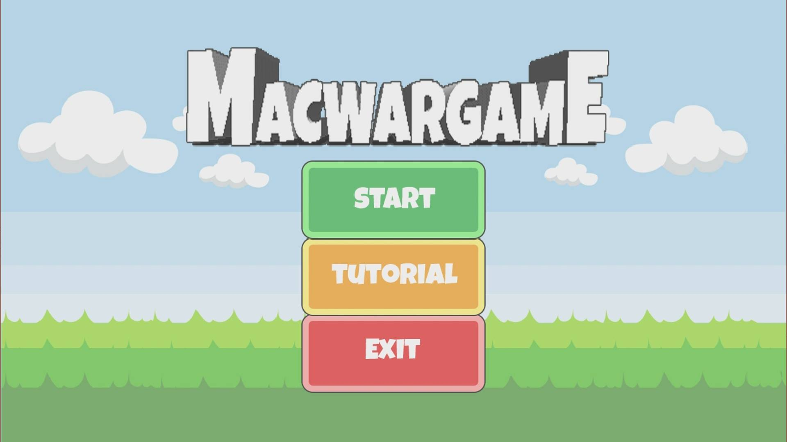
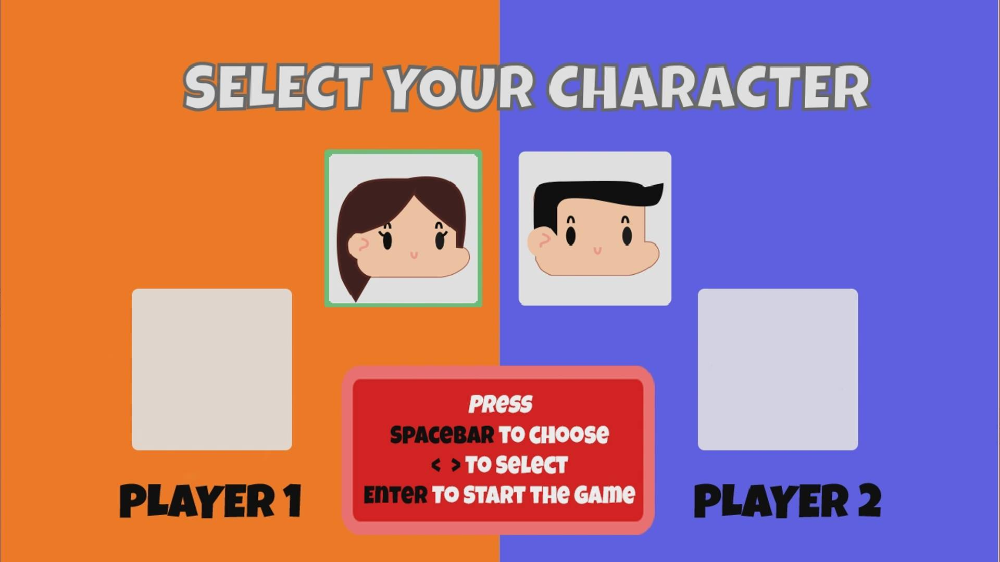
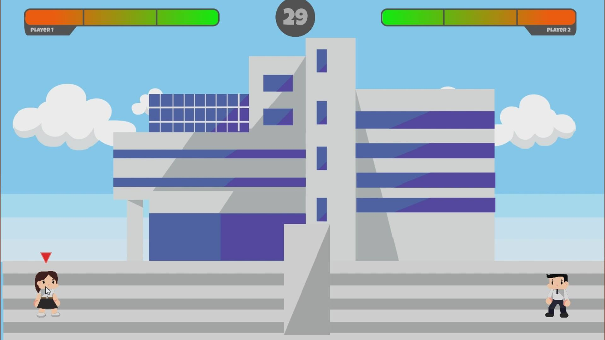

# MacWarGame

Group 41 - OBJECT-ORIENTED PROGRAMMING ( OOP )

## 💬 Introduction

เกมเป็นสิ่งที่แพร่หลายและเป็นที่นิยมอย่างมากในปัจจุบัน เราปฎิเสธไม่ได้ว่าคนกว่าครึ่งโลกตั้งแต่เด็กที่มีอายุน้อยจวบจนเติบโตเป็นผู้ใหญ่ต้องเคยผ่านการเล่นเกมมาแล้วอย่างแน่นอน ไม่ว่าจะเป็นเกมที่สร้างเผื่อความบันเทิง หรือ เกมที่ต้องใช้ความคิดในการเล่นต่างๆ และแนวโน้มที่ด้านความนิยมนี้ยังพุ่งขึ้นสูงเรื่อยๆในทุกๆปี
ทางทีมพัฒนาจึงมีความประสงค์ที่จะทำการฝึกฝนเพื่อที่จะได้มีความสามารถในการเข้าร่วมเป็นส่วนหนึ่งของวงการนี้ โดยเกมที่เราจะทำการพัฒนานี้จะเป็นเกมที่มีแรงบันดาลใจมาจากเกม Cat & Dog ซึ่งเป็นเกมในวัยเด็กของใครหลายๆคน โดยที่ทางทีมพัฒนาเลือกที่จะทำเกมนี้เพราะ เกมนี้สามารถทำให้ผู้เล่นสามารถสัมผัสถึงความประสบการณ์ในวัยเด็กได้ และเกมนี้ยังเป็นเกมที่ต้องมีการใส่ฟิสิกส์เข้าไปในเกมอีกด้วย ทางผู้พัฒนาจึงเห็นว่าการทำเกมแนวนี้จะเป็นจุดเริ่มต้นที่ดีสำหรับผู้พัฒนาเอง

---

## 💾 How to run MacWarGame

1. ดาวน์โหลดไฟล์ที่ https://drive.google.com/file/d/1qZGW6cCa2oCJWPsfqB0uOkGDhWVSFWAj/view?usp=sharing
2. Open MacBookWar.jar

---

## 🎮 How to play

ใช้เมาส์คลิ๊กที่ปุ่ม Start เพื่อเข้าสู่หน้าเลือกตัวละคร หรือ ใช้เมาส์คลิ๊กที่ปุ่ม Tutorial เพื่อศึกษาวีธีเล่นซะก่อน

หน้า Tutorial
 

จะเข้าสู่หน้าเลือกตัวละคร กดลูกศรซ้าย-ขวา เพื่อเป็นการดูตัวละคร และเลือกด้วยปุ่ม spacebar หลังจาก player1 และ player2 เลือกเสร็จแล้วให้กด enter เพิ่มเริ่มเกม

หลังจากเลือกตัวละครเสร็จผู้เล่นจะต้องโยน Macbook ใส่ผู้เล่นฝ่ายตรงข้าม และจะมีสิ่งกีดขวางอยู่ตรงกลางเพื่อไม่ให้ผู้เล่นสามารถโยน Macbook ใส่กันได้ยากขึ้น โดยจะเป็นการเปลี่ยนเมาส์กันเล่น และหากไม่ทำการโยน Macbook จนครบ 30 วินาทีตามเวลาด้านบน ตัวเกมจะทำการเปลี่ยนเทิร์นผู้เล่นไปอีกฝั่งแทน

หากใครสามารถทำให้ผู้เล่นอีกฝ่ายมี lifepoint เป็น 0 ได้ก่อนจะเป็นผู้ชนะ

---

## 📽 Game Storyboard

---

## 💻 Our Team | สมาชิกกลุ่ม

||||
| :--------: | :--------: | :--------: |
| <b> [@tintinap](https://github.com/tintinap) | <b> [@PunnyME](https://github.com/PunnyME) | <b> [@tharinee](https://github.com/tharinee) |
| <b>นายตฤณภัทร  ปลั่งศรี  | <b>นายพงศภัค ภิญญาพงษ์  | <b>น.ส.ธารินี แก้วประยูร  |
| <b>60070028 | <b>60070056 | <b>60070033 |

---

## 🎓 Instructor | อาจารย์ที่ปรึกษา

||
| :--------: |
| <b>ผศ.ดร. ธนิศา นุ่มนนท์ |
  
---

รายงานนี้เป็นส่วนหนึ่งของวิชา OBJECT-ORIENTED PROGRAMMING (รหัส 06016317)

คณะเทคโนโลยีสารสนเทศ สถาบันเทคโนโลยีพระจอมเกล้าเจ้าคุณทหารลาดกระบัง

---
Faculty of Information Technology

King Mongkut's Institute of Technology Ladkrabang
